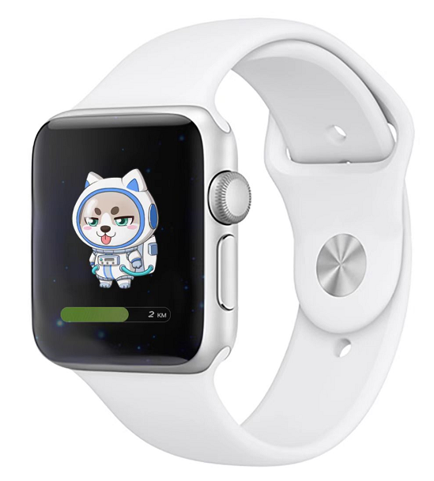

# Parameter information

### Basic parameters

* **Product Name: smart Bracelet**
* **Body material: zinc alloy + IML injection molding process**
* **Screen size: 1.39inch**
* **Equipment requirements: Android 5.0 or IOS 10.0 and above size: φ 46.5\*12.2mm**
* **Strap material: liquid silicone**
* **Bluetooth: blueteeth5.2**
* **Memory: 128MB**
